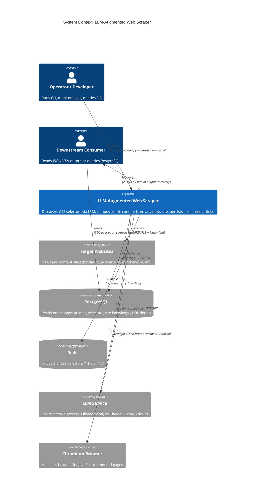
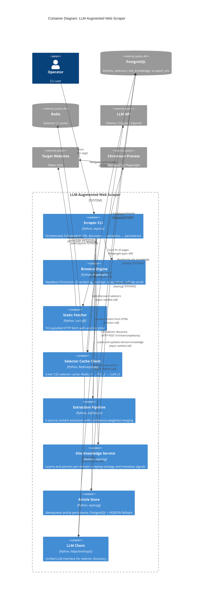
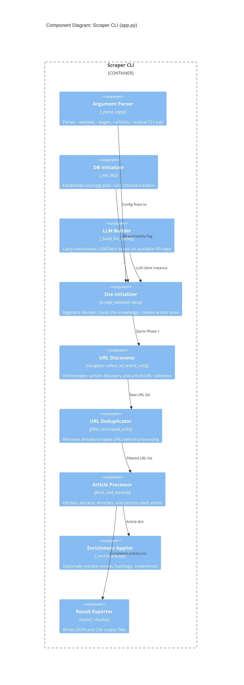
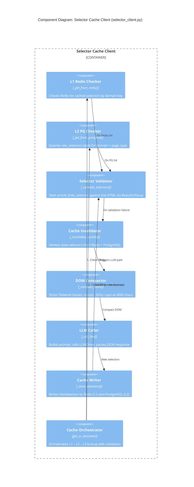
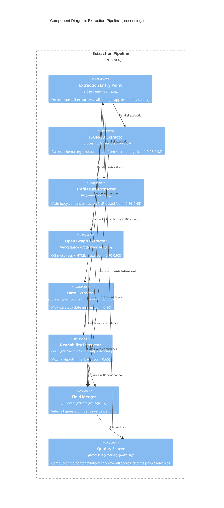
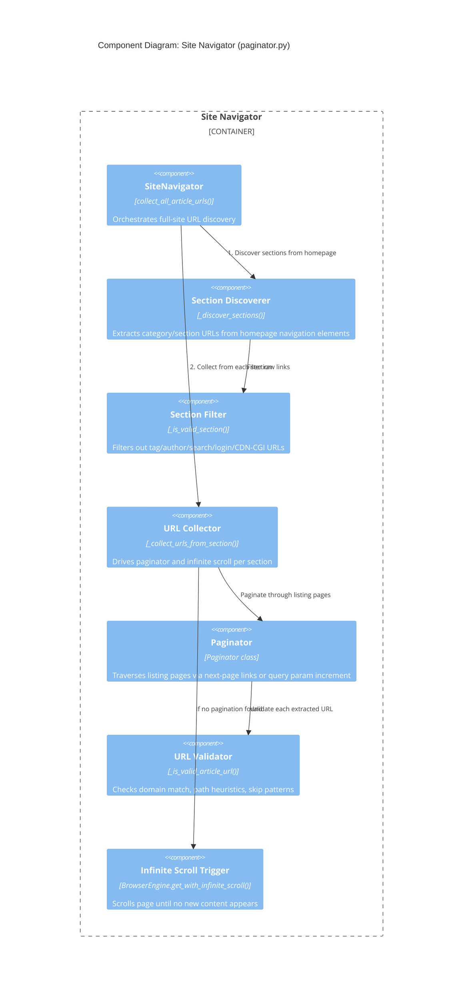
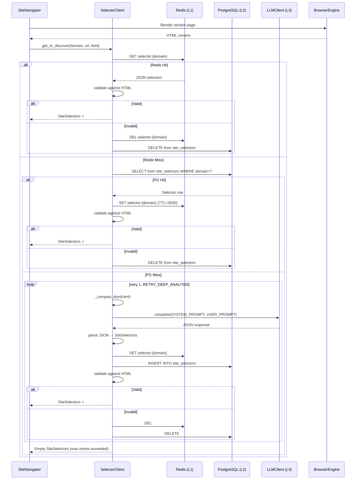
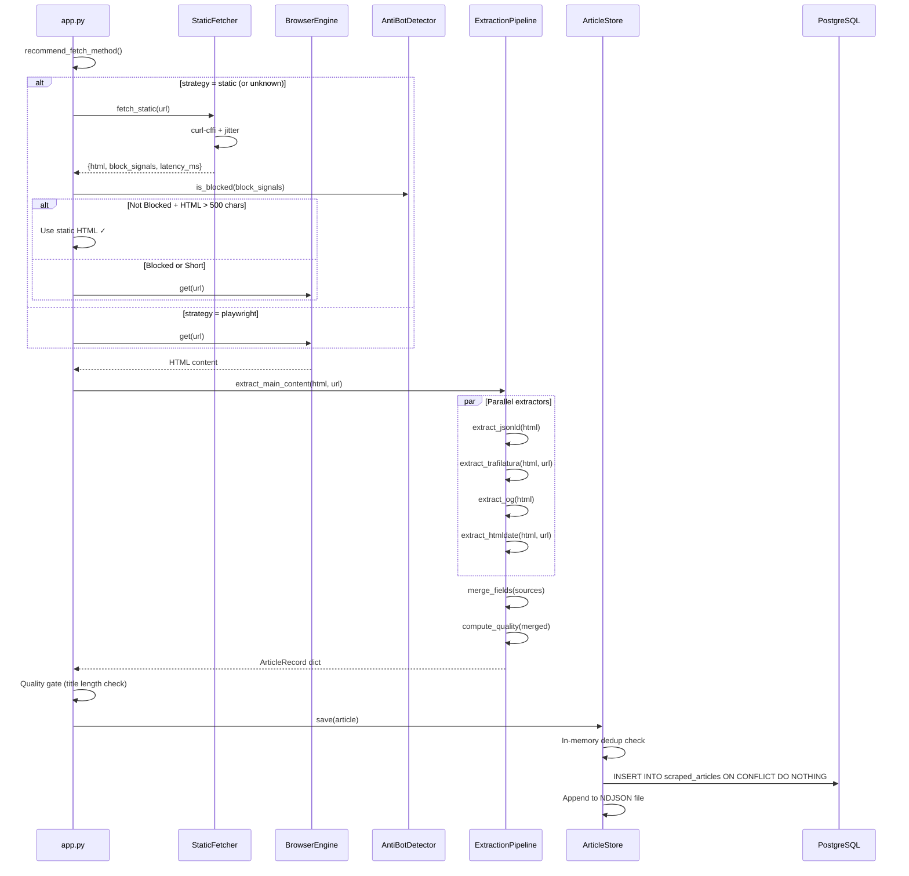
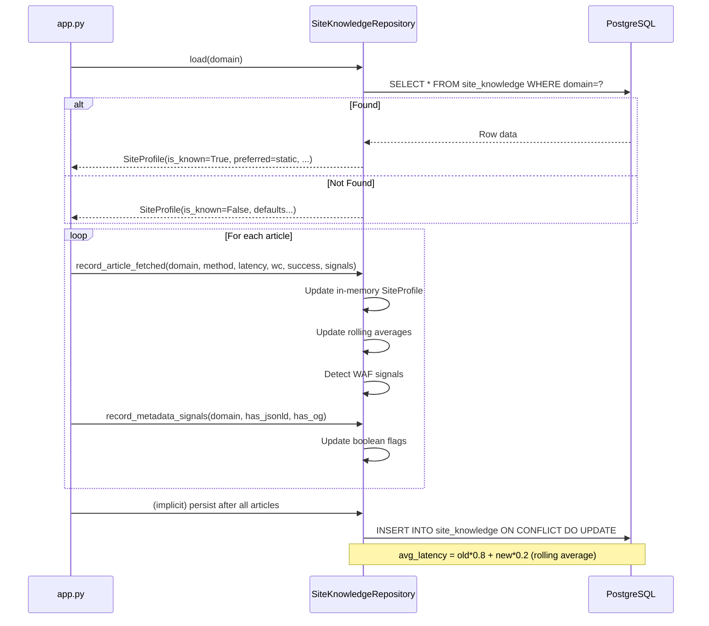
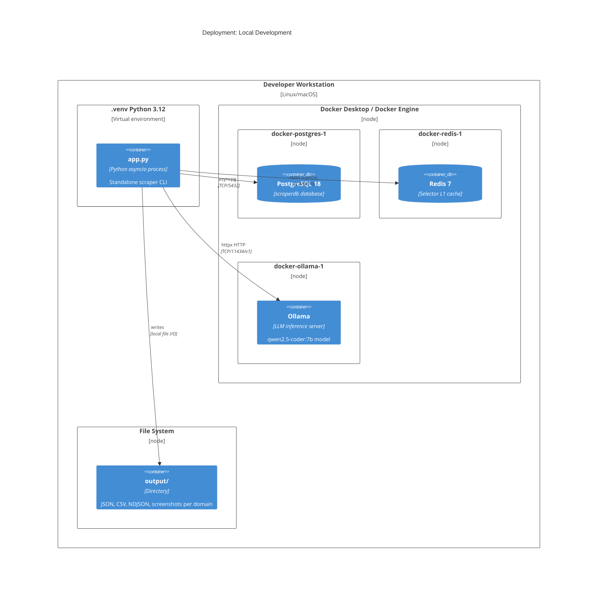

# C4 Architecture Documentation
# LLM-Augmented Web Scraper

> **C4 Model Version:** 1.0 | **Updated:** 2026-03-08

The C4 model (Context, Containers, Components, Code) provides a hierarchical set of architecture diagrams that describe the system at different levels of abstraction. This document covers all four levels for the LLM-Augmented Web Scraper.

---

## Table of Contents

1. [Level 1: System Context Diagram](#1-level-1-system-context-diagram)
2. [Level 2: Container Diagram](#2-level-2-container-diagram)
3. [Level 3: Component Diagram](#3-level-3-component-diagram)
4. [Level 4: Code-Level Architecture Narrative](#4-level-4-code-level-architecture-narrative)
5. [Data Flow Diagrams](#5-data-flow-diagrams)
6. [Deployment Diagram](#6-deployment-diagram)

---

## 1. Level 1: System Context Diagram

### Description

The system context diagram shows the LLM-Augmented Web Scraper as a single system box and its relationships with external actors and external systems.

**External Actors:**
- **Operator / Developer**: Invokes the scraper via CLI, monitors logs and metrics, queries the database for results
- **Downstream Consumer**: A system or person that reads the exported JSON/CSV files or queries `scraped_articles` directly

**External Systems:**
- **Target Websites**: Any news or content site being scraped (e.g., biziday.ro, adevarul.ro)
- **PostgreSQL**: Primary persistent storage for articles, selectors, and site knowledge
- **Redis**: In-process L1 cache for CSS selectors (hot path)
- **LLM Service**: Either local Ollama (qwen2.5-coder:7b), Anthropic Claude API, or OpenAI-compatible API
- **Chromium (via Playwright)**: Managed subprocess for browser rendering; Playwright manages its lifecycle

### Context Diagram



### Context Narrative

The scraper is invoked by an operator from the command line. It has no inbound network interface (it is a CLI tool, not a server). All communication is outbound:

1. The scraper reads from and writes to PostgreSQL for persistent knowledge and article storage
2. It reads from and writes to Redis for fast selector caching
3. It makes HTTP requests to target websites (static fetch via curl-cffi or Playwright-mediated via Chromium)
4. It calls the LLM service only when CSS selectors are not cached
5. It writes output files locally to the `output/` directory

The operator sees log output on stdout and can query PostgreSQL directly for analysis. Downstream consumers read the exported JSON/CSV files or query the `scraped_articles` table.

---

## 2. Level 2: Container Diagram

### Description

The container diagram decomposes the scraper system into its major logical containers (processes, applications, data stores).

**Containers:**
- **Scraper CLI** (`app.py`): Orchestration process; the only executable entry point in standalone mode
- **Browser Engine** (`BrowserEngine`): Playwright subprocess controller; manages Chromium lifecycle
- **Static Fetcher** (`StaticFetcher`): In-process HTTP client with TLS spoofing
- **Selector Cache** (`SelectorClient`): Three-tier cache manager (Redis → PG → LLM)
- **Extraction Pipeline** (`processing/`): Multi-source HTML → structured data transformer
- **Site Knowledge Store** (`SiteKnowledgeRepository`): Per-domain learning accumulator
- **Article Store** (`ArticleStore`): Dual-sink article persistence manager
- **LLM Client** (`LLMClient`): Unified LLM interface (Claude / OpenAI / Ollama)

### Container Diagram



### Container Responsibilities

| Container | Responsibility | Key Dependencies |
|-----------|---------------|-----------------|
| Scraper CLI | Pipeline orchestration, CLI parsing, export | All other containers |
| Browser Engine | Chromium lifecycle, JS rendering, overlay dismissal, screenshots | Playwright, Chromium binary |
| Static Fetcher | TLS-spoofed HTTP, anti-bot jitter, block detection | curl-cffi, requests |
| Selector Cache Client | Three-tier cache management, selector validation, LLM trigger | Redis, PostgreSQL, LLM Client |
| Extraction Pipeline | 5-source extraction, confidence merge, quality scoring | trafilatura, htmldate, readability-lxml |
| Site Knowledge Service | Load/update per-domain strategy and signals | PostgreSQL |
| Article Store | Idempotent persistence, in-memory dedup, NDJSON fallback | PostgreSQL, file system |
| LLM Client | Unified API access, JSON parsing, metrics | httpx, anthropic SDK |

---

## 3. Level 3: Component Diagram

### Description

The component diagram decomposes the major containers into their internal components and shows how they collaborate.

### 3.1 Scraper CLI Components



### 3.2 Selector Cache Client Components



### 3.3 Extraction Pipeline Components



### 3.4 Site Navigator Components



---

## 4. Level 4: Code-Level Architecture Narrative

This section describes the most important classes and functions in the codebase, their responsibilities, inputs/outputs, and design decisions.

### 4.1 `app.py` — Pipeline Orchestrator

The entry point and orchestration hub. There is no class here — the module uses top-level async functions.

**`scrape_website(domain, max_pages, max_articles, output_dir)`**
- The main pipeline function. Sets up all components, drives Phase 1 (URL discovery) and Phase 2 (extraction), coordinates persistence and knowledge updates.
- Inputs: domain string, page/article limits, output path
- Outputs: list of article dicts
- Side effects: DB writes (articles, URLs, site knowledge), files written (NDJSON, JSON, CSV)
- Error handling: each phase is independently fallible; `db_ok` flag propagates DB unavailability

**`fetch_and_extract(url)`** (inner closure)
- Per-article processing unit. Wrapped by `asyncio.Semaphore` for concurrency control.
- Uses closure to capture `browser`, `selector_client`, `site_profile`, `knowledge`, `article_store`
- Returns `dict` on success, `None` on failure (discarded by caller)
- Design: closure pattern avoids parameter threading through many layers

**`_build_llm_client()`**
- Lazy initialization: checks for ANTHROPIC_API_KEY, OPENAI_API_KEY, LLM_BASE_URL in order
- Returns `None` if none configured (selectors will only use cache)
- Design: LLM client is expensive to initialize; only created if needed

### 4.2 `scraper/engines/browser_engine.py` — `BrowserEngine`

Async context manager wrapping Playwright. All browser state (playwright, browser, context, page) is held in instance variables.

**`__aenter__` / `__aexit__`**
- Creates Playwright event loop, launches Chromium, creates browser context with stealth
- Browser args: `--no-sandbox`, `--disable-gpu`, `--disable-dev-shm-usage` (Docker compatibility)
- Viewport: 1366×768 (common desktop resolution)
- Locale: `en-US`, timezone: `America/New_York` (to avoid locale-based content variation)
- On exit: closes page, context, browser, playwright — in that order

**`get(url, wait_for)`**
1. Navigate with `wait_until=wait_for`
2. `_dismiss_overlays()`: inject CSS to hide cookie banners, click accept buttons
3. Scroll 5 times with 1.5s waits (lazy-loaded content)
4. Return `page.content()`

**`get_with_infinite_scroll(url, max_scrolls, wait_ms)`**
- Tracks `content_length` before each scroll
- Stops when 3 consecutive scrolls produce no new content (stability detection)
- Tries "Load More" button selectors between scrolls

**`_dismiss_overlays()`**
- CSS injection: hides elements matching 15 cookie/consent patterns
- JS execution: clicks buttons matching text patterns in multiple languages
- `document.body.style.overflow = 'auto'` — restores scroll if banners blocked it
- Swallows all exceptions (overlay dismissal is best-effort)

**`get_with_screenshot(url, path, wait_for, screenshot_type)`**
- Same as `get()` but additionally calls `page.screenshot(full_page=True, quality=80)`
- Creates parent directories before writing
- Returns HTML content alongside saving screenshot file

### 4.3 `scraper/fetchers/static_fetcher.py` — `fetch_static()`

Async function (runs `curl-cffi` in thread executor since it's synchronous).

**Algorithm**:
1. Import `curl-cffi`; if unavailable, fall through to `requests`
2. Apply random jitter delay (150–750ms) — simulates human reading time
3. Try curl-cffi with `impersonate="chrome124"`, 3 attempts with 1s backoff
4. On failure: try requests library with standard headers
5. Run `is_blocked()` on response headers + first 8KB of body
6. Return standard result dict

**Return schema**:
```python
{
    "html": str,
    "final_url": str,
    "status_code": int,
    "headers": dict,
    "latency_ms": int,
    "method": "curl_cffi" | "requests",
    "block_signals": list[str],
    "error": str | None
}
```

### 4.4 `scraper/detectors/anti_bot.py` — `is_blocked()`

Simple function that checks a list of block signals (strings) against a hardcoded blocklist categorized by WAF type.

**Detection categories**:
- `cloudflare`: CF-Ray header present, "Attention Required" page text
- `datadome`: `__ddg` cookie, DataDome header
- `captcha`: reCAPTCHA/hCaptcha presence
- `js_challenge`: "JavaScript required" page text
- `rate_limit`: HTTP 429 status
- `server_error`: HTTP 503, 520–524
- `paywall`: "Subscribe to continue" variants (not treated as hard block)

`is_blocked()` returns `True` for all except paywall signals (paywall content is extractable but flagged).

### 4.5 `scraper/navigation/paginator.py` — `SiteNavigator` + `Paginator`

**`SiteNavigator._discover_sections(start_url)`**:
- Renders homepage with Playwright
- Tries 14 CSS nav selectors (nav, header, [role=navigation], .menu, etc.) in order
- Collects all `<a href>` elements from matching containers
- Filters: same domain, not in skip list, path depth ≤ 2 segments
- Returns unique section URLs

**`Paginator.next_page_url(html, current_url)`**:
- Tries LLM-discovered `pagination_next_selector` first
- If no match: tries all 16 `FALLBACK_NEXT_SELECTORS`
- If still no match: tries query parameter increment (`?page=N` → `?page=N+1`)
- Returns absolute URL or `None`

**Article URL extraction heuristics**:
- `<a>` elements matching `article_links_selector`
- URL must contain a path segment (not homepage)
- Link text length > 15 chars (excludes nav links)
- Not a pagination URL (no `?page=`, no `/page/`)
- Not in skip list (tags, authors, search, login, CDN-CGI paths)

### 4.6 `scraper/selector_client.py` — `SelectorClient`

The most complex component. Manages the entire selector lifecycle.

**`get_or_discover(domain, url, html, page_type)`**:
```
1. _get_from_redis(domain, page_type)
   → hit: _validate_selectors(selectors, html) → valid: return
2. _get_from_postgres(domain, page_type)
   → hit: _write_to_redis(domain, selectors) → _validate → valid: return
3. for attempt in range(RETRY_DEEP_ANALYSIS):
       selectors = _call_llm(domain, url, html, page_type)
       _store_selectors(domain, selectors)
       if _validate_selectors(selectors, html): return selectors
       _invalidate_caches(domain, page_type)
4. return empty SiteSelectors
```

**`_compact_dom(html)`**:
- BeautifulSoup decompose: `script`, `style`, `svg`, `iframe` elements removed
- For each element's `class` attribute: remove individual classes matching Tailwind patterns
  - Patterns: single chars, `flex`, `grid`, classes with `:`, `[`, `]`, `!`
  - Numeric classes: `p-4`, `m-2`, `text-xl`, `bg-gray-500`, etc.
- If class list becomes empty: remove `class` attribute entirely
- Render to string, truncate to 4,000 characters

**`_call_llm(domain, url, html, page_type)`**:
- Direct mode (`llm_client` injected): calls `LLMClient.complete(system, user)`
- HTTP mode (no `llm_client`): POST to `{LLM_ENDPOINT}/v1/analyze-selectors`
- Parses response via `LLMClient.parse_json_response()` — handles markdown code blocks
- Constructs `SiteSelectors` from parsed dict

### 4.7 `scraper/knowledge/site_knowledge.py` — `SiteKnowledgeRepository`

**`load(domain)`**: SELECT from `site_knowledge`; returns `SiteProfile` dataclass; default values if not found.

**`record_article_fetched(domain, method, latency_ms, word_count, success, block_signals)`**:
- Updates `SiteProfile` in memory with rolling statistics
- Detects Cloudflare/DataDome/reCAPTCHA from `block_signals`
- If success + static method: increments static success counter
- If block rate > 30%: sets `preferred_fetch_method = playwright`
- Deferred: `upsert_site_knowledge()` is called at run end (not after each article)

**`SiteProfile.recommend_fetch_method()`**:
```python
def recommend_fetch_method(self) -> str:
    if self.is_spa or self.requires_js:
        return STRATEGY_PLAYWRIGHT
    if self.preferred_fetch_method == STRATEGY_STATIC and self.block_rate < 0.30:
        return STRATEGY_STATIC
    return STRATEGY_PLAYWRIGHT  # safe default
```

### 4.8 `shared/db.py` — Database Layer

All DB operations use asyncpg's `Pool` created by `init_pool()`.

**Pattern**: Every DB function uses `async with get_db() as conn:` — acquires connection from pool, auto-returns on exit.

**`run_schema()`**: Executes a multi-statement DDL string with `CREATE TABLE IF NOT EXISTS` for all 9 tables. Safe to call every startup.

**`save_article(article_dict)`**:
```sql
INSERT INTO scraped_articles (url, domain, title, content, ..., raw_json)
VALUES ($1, $2, $3, ..., $N::jsonb)
ON CONFLICT (url) DO NOTHING
```
The `raw_json` column stores the entire `article_dict` as JSONB, making future schema migrations non-destructive.

**`filter_unscraped_urls(urls)`**:
```sql
SELECT url FROM scraped_urls WHERE url = ANY($1)
```
Returns set of already-scraped URLs; caller computes difference.

**`upsert_site_knowledge(domain, fields_dict)`**:
```sql
INSERT INTO site_knowledge (domain, preferred_fetch_method, ...)
VALUES ($1, $2, ...)
ON CONFLICT (domain) DO UPDATE SET
  preferred_fetch_method = EXCLUDED.preferred_fetch_method,
  avg_latency_ms = (site_knowledge.avg_latency_ms * 0.8 + EXCLUDED.avg_latency_ms * 0.2),
  ...
  updated_at = NOW()
```
Rolling average formula (80%/20% weight) for smoothed latency tracking.

### 4.9 `shared/article_store.py` — `ArticleStore`

Lightweight wrapper providing dual-sink persistence with in-memory dedup.

```python
class ArticleStore:
    def __init__(self, db_ok: bool, ndjson_path: Path):
        self._db_ok = db_ok
        self._ndjson = open(ndjson_path, "a", encoding="utf-8")
        self._seen_urls: set[str] = set()

    async def save(self, article: dict):
        url = article["url"]
        if url in self._seen_urls:
            return  # in-memory dedup guard
        self._seen_urls.add(url)

        if self._db_ok:
            await save_article(article)  # shared/db.py

        self._ndjson.write(json.dumps(article, ensure_ascii=False) + "\n")
        self._ndjson.flush()

    def close(self):
        self._ndjson.close()
```

The `flush()` on every write ensures articles are durable even if the process crashes before `close()` is called.

### 4.10 `processing/filters/extractor.py` — `extract_main_content()`

Master extraction function. Calls all extractors, collects results with confidence metadata, delegates to merge and quality scoring.

```python
def extract_main_content(html: str, url: str) -> dict | None:
    sources = {}

    jsonld_data = extract_jsonld(html)
    if jsonld_data:
        sources["jsonld"] = {"data": jsonld_data, "confidence": 0.97}

    traf_data = extract_trafilatura(html, url)
    if traf_data:
        sources["trafilatura"] = {"data": traf_data, "confidence": 0.92}

    og_data = extract_og(html)
    if og_data:
        sources["og"] = {"data": og_data, "confidence": 0.80}

    date_data = extract_date(html, url)
    if date_data:
        sources["htmldate"] = {"data": date_data, "confidence": 0.90}

    if not traf_data or len(traf_data.get("text", "")) < 100:
        read_data = extract_readability(html)
        if read_data:
            sources["readability"] = {"data": read_data, "confidence": 0.65}

    if not sources:
        return None

    merged, field_sources, field_confidence = merge_fields(sources)
    quality = compute_quality(merged)
    return {**merged, **quality, "field_sources": field_sources, "field_confidence": field_confidence}
```

### 4.11 `processing/scoring/merge.py` — Field Merging

**`FIELD_PRIORITY`**: dict mapping each field to ordered list of preferred sources:
```python
FIELD_PRIORITY = {
    "title":   ["jsonld", "trafilatura", "og", "readability"],
    "author":  ["jsonld", "trafilatura", "og"],
    "date":    ["jsonld", "htmldate", "trafilatura", "og"],
    "content": ["trafilatura", "readability", "jsonld"],
    "summary": ["trafilatura", "jsonld", "og"],
    ...
}
```

**`pick_field(field, sources)`**: Iterates priority list; returns first non-empty value from highest-priority source along with (source_name, confidence_score).

**`merge_fields(sources)`**: Calls `pick_field()` for each field; builds `merged`, `field_sources`, `field_confidence` dicts.

### 4.12 `processing/scoring/quality.py` — Quality Scoring

```python
def compute_quality(article: dict) -> dict:
    title_score = 1.0 if article.get("title") else 0.0
    content_score = min(1.0, len(article.get("text", "").split()) / 600)
    date_score = 1.0 if article.get("date") else 0.0
    author_score = 1.0 if article.get("author") else 0.0
    overall = 0.25 * title_score + 0.45 * content_score + 0.15 * date_score + 0.15 * author_score

    text = article.get("text", "").lower()
    likely_paywalled = any(p in text for p in PAYWALL_PATTERNS)
    likely_liveblog = any(p in text for p in LIVEBLOG_PATTERNS)

    word_count = len(article.get("text", "").split())
    reading_time = max(1, word_count // 200)

    return {
        "title_score": title_score,
        "content_score": content_score,
        "date_score": date_score,
        "author_score": author_score,
        "overall_score": round(overall, 3),
        "likely_paywalled": likely_paywalled,
        "likely_liveblog": likely_liveblog,
        "word_count": word_count,
        "reading_time_minutes": reading_time,
    }
```

### 4.13 `llm_api/llm_client.py` — `LLMClient`

**Provider selection** (in order):
1. If `ANTHROPIC_API_KEY`: use `anthropic.AsyncAnthropic()` → Claude models
2. If `OPENAI_API_KEY`: use `openai.AsyncOpenAI()` → GPT-4o-mini
3. If `LLM_BASE_URL`: use `openai.AsyncOpenAI(base_url=LLM_BASE_URL, api_key="ollama")` → Ollama/vLLM

**`complete(system_prompt, user_prompt, endpoint_label)`**:
- Calls appropriate provider's chat completion API
- Temperature: 0.1 (near-deterministic for CSS selector generation)
- Max tokens: 1024 (selectors fit easily; caps runaway generation)
- Timeout: 60 seconds
- Returns `(response_text: str, model_name: str)`

**`parse_json_response(text)`**:
1. Try direct `json.loads()` first
2. Strip markdown code blocks (` ```json ... ``` `)
3. Find `{...}` boundary in response if LLM added prose
4. Remove trailing commas before closing braces/brackets (common LLM mistake)
5. Return parsed dict or raise `ValueError`

---

## 5. Data Flow Diagrams

### 5.1 Selector Discovery Data Flow



### 5.2 Article Extraction Data Flow



### 5.3 Site Knowledge Learning Flow



---

## 6. Deployment Diagram

### Local Development Deployment



### Full Docker Stack (docker-compose)

```
┌─────────────────────────────────────────────────────────────┐
│                    Docker Compose Network                    │
│                                                             │
│  ┌──────────┐  ┌──────────┐  ┌──────────┐  ┌──────────┐  │
│  │PostgreSQL│  │  Redis   │  │  Kafka   │  │  MinIO   │  │
│  │  :5432   │  │  :6379   │  │  :9092   │  │  :9000   │  │
│  └────┬─────┘  └────┬─────┘  └────┬─────┘  └─────┬────┘  │
│       │              │              │               │        │
│  ┌────┴─────┐  ┌─────┴────┐  ┌────┴─────┐  ┌─────┴────┐  │
│  │ pgAdmin  │  │  Scraper │  │Kafka UI  │  │ Kibana   │  │
│  │  :5050   │  │(app.py)  │  │  :8090   │  │  :5601   │  │
│  └──────────┘  └──────────┘  └──────────┘  └──────────┘  │
│                                                             │
│  ┌──────────┐  ┌──────────┐  ┌──────────────────────────┐ │
│  │ llm_api  │  │Scheduler │  │    Elasticsearch          │ │
│  │  :8000   │  │          │  │        :9200              │ │
│  └──────────┘  └──────────┘  └──────────────────────────┘ │
│                                                             │
│  ┌──────────┐                                              │
│  │  Ollama  │                                              │
│  │ :11434   │                                              │
│  └──────────┘                                              │
└─────────────────────────────────────────────────────────────┘
```

**Note**: In standalone mode (`python3 app.py`), only PostgreSQL, Redis, and Ollama are required. Kafka, Elasticsearch, MinIO, Kibana, and the distributed services (`llm_api`, `scheduler`) are only needed for the full distributed architecture.

### Architecture Decision: Standalone vs. Distributed Mode

The codebase supports two operating modes:

**Standalone Mode** (current primary mode):
- Single process: `app.py`
- Direct LLM client (no HTTP hop to `llm_api`)
- No Kafka dependency
- Suitable for: development, one-off scraping, small-scale operations

**Distributed Mode** (via Docker Compose):
- `scraper` service produces raw HTML to Kafka
- `processing` service consumes HTML, processes via pipeline
- `llm_api` service provides HTTP API for selector discovery
- `scheduler` service manages job queuing
- Suitable for: high-volume, multi-node scraping operations

The `SelectorClient` supports both modes via the `llm_client` constructor parameter:
- `SelectorClient(llm_client=LLMClient())` → standalone (direct call)
- `SelectorClient(llm_client=None)` → distributed (HTTP call to `LLM_ENDPOINT`)
